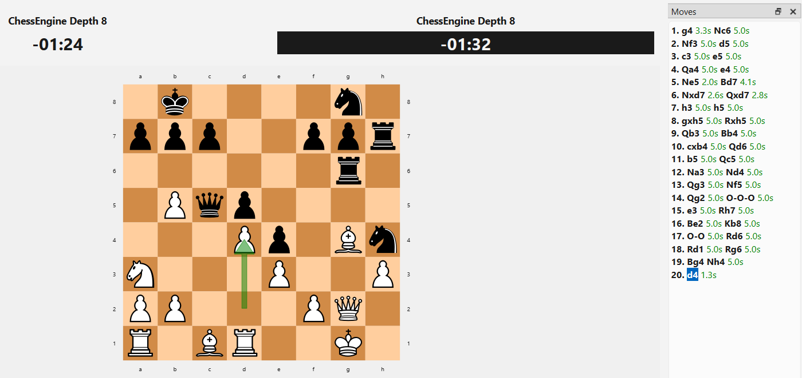

# ChessEngine

A chess engine written from scratch in C++20 with no external dependencies. It speaks the UCI protocol, so you play it (or pit it against other engines) through a GUI such as [Cute Chess](https://cutechess.com/). The executable has no board or window of its own.

## Specs

| Area        | Details                                                                                  |
| ----------- | ---------------------------------------------------------------------------------------- |
| Language    | C++20, built with CMake 3.20+                                                            |
| Protocol    | UCI over stdin/stdout                                                                    |
| Board       | 64-square array with per-piece position lists                                            |
| Search      | Negamax, alpha-beta, iterative deepening, aspiration windows, quiescence, null-move      |
| Hashing     | Zobrist keys, 2^20-entry transposition table                                             |
| Evaluation  | Material + piece-square tables, endgame king-driving term                                |
| Time        | `depth`, `movetime`, `wtime`/`btime`, `winc`/`binc`, `movestogo`; search on its own thread |

## Build

```
git clone https://github.com/tonislavkolev9/ChessEngine.git
cd ChessEngine
cmake -S . -B build -DCMAKE_BUILD_TYPE=Release
cmake --build build
```

With Visual Studio on Windows (a multi-config generator), pick the configuration when building instead:

```
cmake -S . -B build
cmake --build build --config Release
```

Use a Release build; Debug is far too slow for search. The binary is `build/ChessEngine`, or `build\Release\ChessEngine.exe` on Windows. Every `.cpp` in `src/` is compiled automatically, so after adding a file just re-run the configure step.

## Play it in Cute Chess

Launching the executable directly only opens a silent UCI prompt, so load it into a GUI:

1. In Cute Chess, open **Tools > Settings > Engines** and click **+**.
2. Set **Command** to the executable, **Protocol** to **UCI**, and the **Working Directory** to its folder if asked.
3. Start a game from **Game > New** with *Human* vs *ChessEngine*, or pick an engine for both sides to watch a match. `cutechess-cli`, bundled with Cute Chess, can run engine-vs-engine matches from the command line.

## Under the hood

### Board and move generation

The position is a 64-square array, plus a list of square indices for each piece type so the generator never scans empty squares. Moves are generated pseudo-legally (castling, en passant and promotions included), then `LegalMoveFiltering.cpp` drops any that leave the mover's king attacked. `makeMove` / `unmakeMove` update the board in place, and each `Move` carries the old castling rights, en passant square and captured piece so it can be undone exactly.

Squares are numbered 0-63 from a8 to h1: `a8 = 0`, `h8 = 7`, `a1 = 56`, `h1 = 63`.



### Search

`go` starts a search thread that runs the pipeline below (all in `src/negaMax.cpp`).

```
iterativeDeepening (depth 1..N)          stops on depth limit or timer
 └─ searchBestMove                       root search, aspiration window (+/-50 cp)
     └─ negaMax                          alpha-beta, TT probe, repetition check
         ├─ null-move pruning            depth >= 3, not in check, non-pawn material left
         ├─ move ordering                TT move, then MVV-LVA captures, then promotions
         ├─ TT store                     exact / lower / upper bound entries
         └─ quiescence                   captures and promotions at depth 0
             └─ evaluate                 material + piece-square tables
```

Two details worth knowing:

- **Timeouts** are handled by throwing from inside the search, so it unwinds cleanly and the engine plays the best move from the last fully completed depth.
- **Root variety:** root moves scoring within 15 centipawns of the best are picked at random (unless a mate is found), so the engine doesn't replay the same game every time.

Threefold repetition is detected during search using the history of Zobrist keys.

### Evaluation

Each side's score is material (P 100, N 320, B 330, R 500, Q 900) plus a piece-square table bonus for every piece, returned from the side to move's perspective as negamax requires. When one side is far ahead in an endgame, an extra term pushes the losing king toward the edge and brings the winning king closer.

## UCI reference

| Command                                                         | Behaviour                                            |
| --------------------------------------------------------------- | ---------------------------------------------------- |
| `uci`, `isready`, `ucinewgame`                                  | Handshake and reset                                  |
| `position startpos [moves ...]`                                 | Start position, optionally followed by moves         |
| `position fen <fen> [moves ...]`                                | Any FEN, optionally followed by moves                |
| `go depth <n>`                                                  | Fixed-depth search                                   |
| `go movetime <ms>`                                              | Fixed time per move                                  |
| `go wtime <ms> btime <ms> [winc <ms> binc <ms> movestogo <n>]`  | Clock-based time management                          |
| `go infinite`                                                   | Capped at depth 8 or 5 seconds                       |
| `go`                                                            | Defaults to depth 4                                  |
| `stop`, `quit`                                                  | Stop the current search / exit                       |

## Testing and debugging

**Perft.** `Perft.cpp` provides `perft` and `perftDivide`, which count leaf nodes to a given depth. Comparing the counts with published perft results for well-known positions is the standard way to verify a move generator. They aren't exposed through UCI yet, so call them from `main.cpp`.

**By hand.** Without a GUI you can type UCI commands directly. Nothing is drawn, you only see text replies:

```
$ ./build/ChessEngine
uci
id name MyEngine
id author Tonislav
uciok
isready
readyok
position startpos moves e2e4 e7e5
go movetime 2000
bestmove g1f3
```

Moves use long algebraic notation (`e2e4`, and `e7e8q` for promotion). To search a specific position:

```
position fen r1bqkbnr/pppp1ppp/2n5/4p3/4P3/5N2/PPPP1PPP/RNBQKB1R w KQkq - 2 3
go depth 6
```

## Source map

| File                     | Responsibility                                          |
| ------------------------ | ------------------------------------------------------- |
| `main.cpp`               | Initialise hash tables, start the UCI loop              |
| `UCI.cpp`                | Parse `position` / `go`, choose limits, run the search thread |
| `BoardState.cpp`         | Board representation, start position, FEN loading       |
| `MoveGen.cpp`            | Pseudo-legal move generation                            |
| `LegalMoveFiltering.cpp` | Remove moves that leave the king in check               |
| `MoveMake.cpp`           | Make / unmake move                                      |
| `Attacks.cpp`            | Square-attacked detection                               |
| `negaMax.cpp`            | Negamax, quiescence, iterative deepening                |
| `Evaluation.cpp`         | Material and piece-square evaluation                    |
| `TranspositionTable.cpp` | Hash table for search results                           |
| `Zobrist.cpp`            | Position hashing                                        |
| `TimeManager.cpp`        | Search timer and stop flag                              |
| `Perft.cpp`              | Move-generation testing                                 |

Headers live in `include/`.

## License

This project is licensed under the MIT License. See the [LICENSE](LICENSE) file for details.
